# APP QUẢN LÍ THƯ VIỆN  

## Final Project for OOP (team 3HTeam)

## Team Members
- Vũ Minh Hiến - 23020064

- Nguyễn Minh Hải - 23020055
  
- Nguyễn Như Hiếu - 23020067

# Giới thiệu
- Ứng dụng quản lý thư viện là một giải pháp phần mềm hiện đại, giúp tối ưu hóa việc quản lý và vận hành các hoạt động trong thư viện.

- Được thiết kế với giao diện trực quan, thân thiện và tích hợp các tính năng mạnh mẽ, ứng dụng đáp ứng nhu cầu của cả người quản trị thư viện và người dùng mượn sách.

- Được viết bằng ngôn ngữ Java và hỗ trợ bởi thư viện JavaFX để tạo ra giao diện đồ hoạ thú vị, đẹp mắt.

# Table of contents.
- [Thư viện và API được sử dụng.](#một-số-thư-viện-và-api-quan-trọng-được-sử-dụng)
- [Điểm nổi bật và chức năng chính của ứng dụng.](#điểm-nổi-bật-và-chức-năng-chính-của-ứng-dụng)
- [Chất lượng code và quy tắc lập trình.](#chất-lượng-code-và-quy-tắc-lập-trình)
- [Cấu trúc dự án.](#cấu-trúc-dự-án)
- [Chi tiết các chức năng.](#chi-tiết-các-chức-năng)
  - [Đăng nhập và đăng kí tài khoản.](#Đăng-nhập-và-đăng-kí-tài-khoản)
    - [Chức năng đăng nhập.](#Chức-năng-đăng-nhập)
    - [Chức năng đăng kí](#Chức-năng-đăng-kí)
    - [Chức năng lấy lại tài khoản nếu quên mật khẩu.](#chức-năng-lấy-lại-tài-khoản-nếu-quên-mật-khẩu)
  - [Phía người quản trị thư viện.](#phía-người-quản-trị-thư-viện)
  - [Phía người dùng mượn sách](#phía-người-dùng-mượn-sách)
  - [Một vài tính năng chung khác của cả trang admin và user.](#một-vài-tính-năng-chung-khác-của-cả-trang-admin-và-user)
- [Cây kế thừa của ứng dụng.](#cây-kế-thừa-của-ứng-dụng)
- [Lược đồ cơ sở dữ liệu của hệ thống.](#lược-đồ-cơ-sở-dữ-liệu-của-hệ-thống)
# Một số thư viện và API quan trọng được sử dụng.
- Google API Libraries: Làm việc với Gmail API và Google Book API.

- JavaMail API: Gửi email qua SMTP(Simple Mail Transfer Protocol).
- MySQL Connector: Kết nối ứng dụng với MySQL.
- HikariCP: Connection pooling hiệu suất cao.
- ZXing: Tạo và đọc mã QR.
- Commons-io: Xử lý mã hóa file.
- Gson: Chuyển đổi giữa JSON và Java Objects.
- iTextPDF: Tạo và chỉnh sửa file PDF.
- JUnit & Mockito: Hỗ trợ unit testing.
- SQLite JDBC: Kết nối SQLite cho môi trường test.

# Điểm nổi bật và chức năng chính của ứng dụng.
- Quản lý tài liệu (thông tin tài liệu, thêm, xóa, sửa, tìm kiếm).

- Quản lý người dùng thư viện (mượn/trả tài liệu,
thông tin thành viên, thêm, sửa, xóa, tìm kiếm).
- Xử lý các trường hợp lỗi, như kiểm tra điều kiện khi
mượn tài liệu, thêm user, ...
- Giao diện người dùng dễ nhìn, thân thiện.
- Tích hợp Google Book API tra cứu thông tin tài liệu.
- Tích hợp Google Mail API để gửi mail cho người dùng.
- Sử dụng đa luồng để cải thiện trải nghiệm người
dùng mượt mà hơn, không bị đứng hình, delay.
- Tạo mã QR cho thông tin phiếu mượn sách.

# Chất lượng code và quy tắc lập trình
- Phát triển ứng dụng sử dụng mô hình MVC.
- Phân chia lớp và thư mục rõ ràng, dễ phát triển, bảo trì.
- Đặt tên biến, phương thức, và lớp đúng và dễ hiểu.
- Sử dụng đúng và áp dụng các nguyên tắc OOP.

- Sử dụng các nguyên tắc coding convention.
- Cài đặt Unit Test bằng JUnit để test chương trình.
- Sử dụng Design Pattern vào ứng dụng như Singleton, Object Pool, Strategy, ...

# Cấu trúc dự án
- config : Các file cấu hình setup cho ứng dụng.
  
- controller : Nhận request , action từ phía **front-end** , sau đó gọi đến **Service Layer** để lấy data cập nhật lên giao diện.
- domain : Thành phần Model trong MVC , mô hình hóa giữa table trong database thành các đối tượng.
- exception : Gồm các custom exception để xử lí trong ứng dụng.
- repository : Đảm nhiệm phần kết nối với database và trả về dữ liệu.
- service : phần logic chính của ứng dụng , nhận yêu cầu từ **Controller** , sau đó gọi đến **Repository Layer** để lấy dữ liệu database và xử lí.
- resources : chứa những tài nguyên tĩnh.
   - image : folder chứa ảnh dùng trong ứng dụng.
   
   - css : folder chứa css cho javafx component.
   - view : chứa các file fxml cho các scene trong ứng dụng.

# Chi tiết các chức năng.
Ứng dụng được phát triển các tính năng cho cả người quản trị thư viện và người dùng mượn sách.
## Đăng nhập và đăng kí tài khoản.
### Chức năng đăng nhập.
- Người dùng nhập tên đăng nhâp và mật khẩu để thực hiện đăng nhập vào ứng dụng.

- Khi người dùng xác thực đăng nhập thành công, tài khoản sẽ được xác thực quyền, nếu là admin thì sẽ được chuyển hướng về giao diện admin, nếu là user sẽ được chuyển hướng về giao diện user.

### Chức năng đăng kí.
- Nếu người dùng chưa có tài khoản, có thể vào trang đăng kí để đăng kí tài khoản sử dụng ứng dụng.

- Chức năng đăng kí chỉ dành cho người dùng mượn sách, admin không thể đăng kí tài khoản mà sẽ được người phát triển ứng dụng tào tài khoản sẵn cho.

- Không thể đăng kí nếu id, username, email đã tồn tại.

### Chức năng lấy lại tài khoản nếu quên mật khẩu.

- Khi người dùng quên mất khẩu và không thể vào ứng dụng thì có thể chọn chức năng quên mật khẩu ở trang login.

- Người dùng nhập email đăng kí tài khoản và lấy mã OTP xác thực được gửi về email.

- Nhập mã OTP và xác thực thành công, thực hiện lấy lại mất khẩu để đăng nhập

## Phía người quản trị thư viện.
- Xem tổng quan hoạt động và dữ liệu của thư viện.
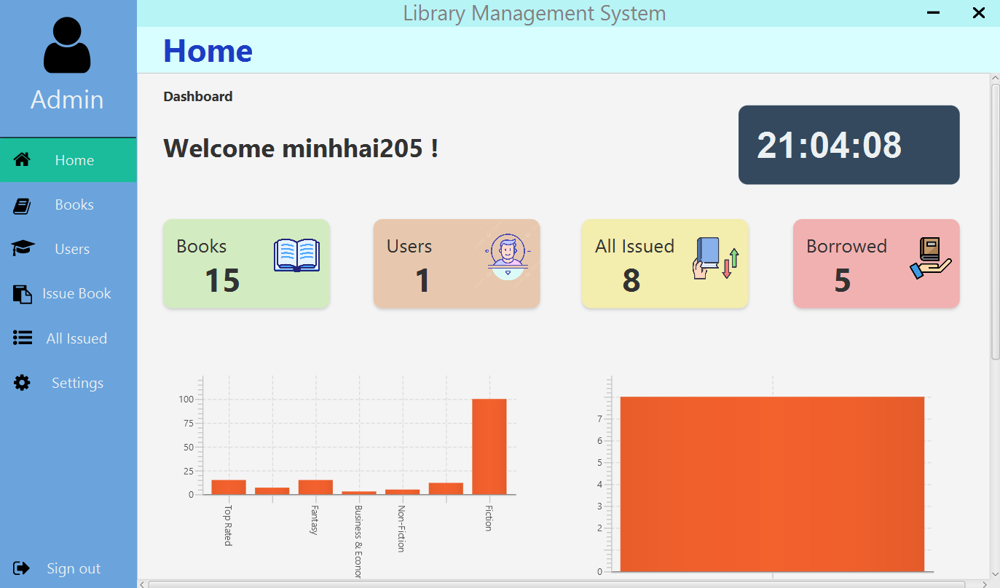
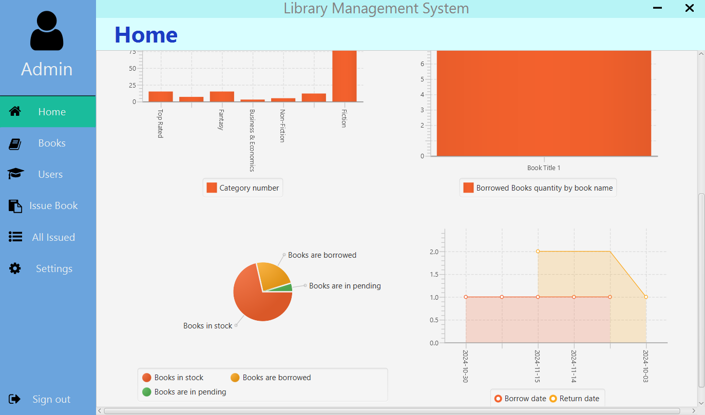

- Quản lí sách( Thêm, sửa, xóa, tìm kiếm theo từ khóa và thể loại tìm kiếm).
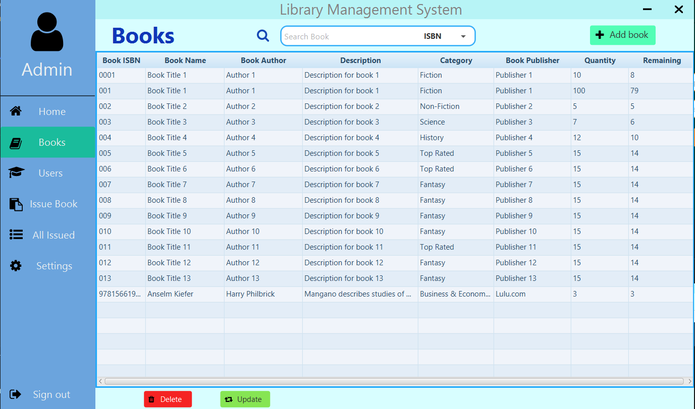
- Update sách.
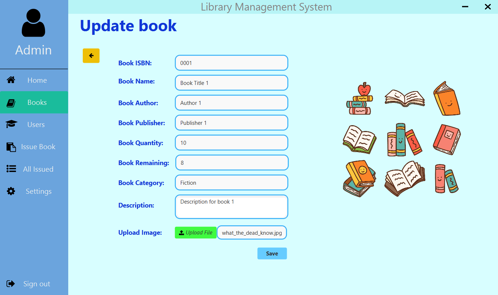
- Thêm mới sách, có thể nhập số ISBN và ấn Find để tìm kiếm dựa vào Google Book, các thông tin sẽ tự động được điền đầy đủ.
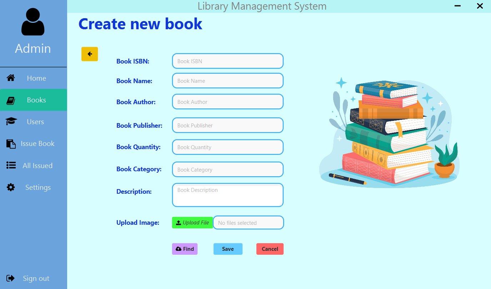
- Quản lí user( Thêm, sửa, xóa, tìm kiếm user dựa vào từ khóa và thể loại tìm kiếm).
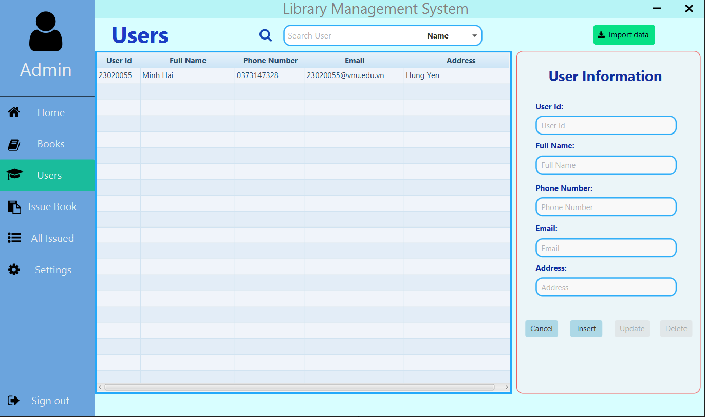
- Ấn chọn user, các thông tin sẽ được tự động điền để thực hiện update.
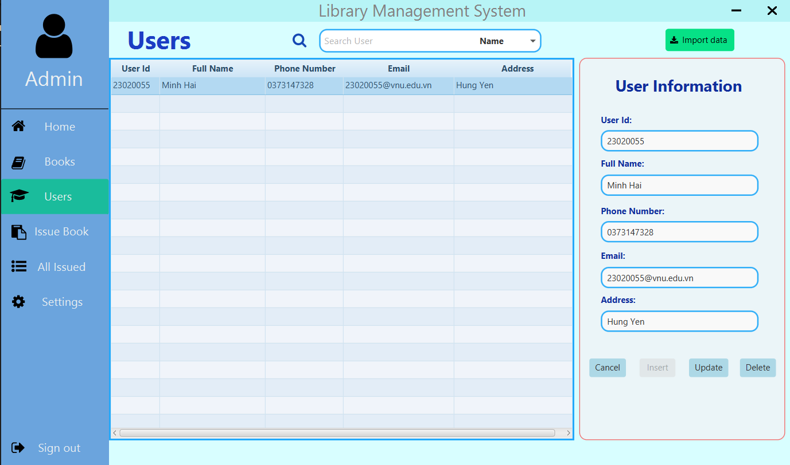
- Tạo phiếu mượn sách cho user mượn sách, khi tạo thành công sẽ tự động gửi email thông tin chi tiết về cho user.
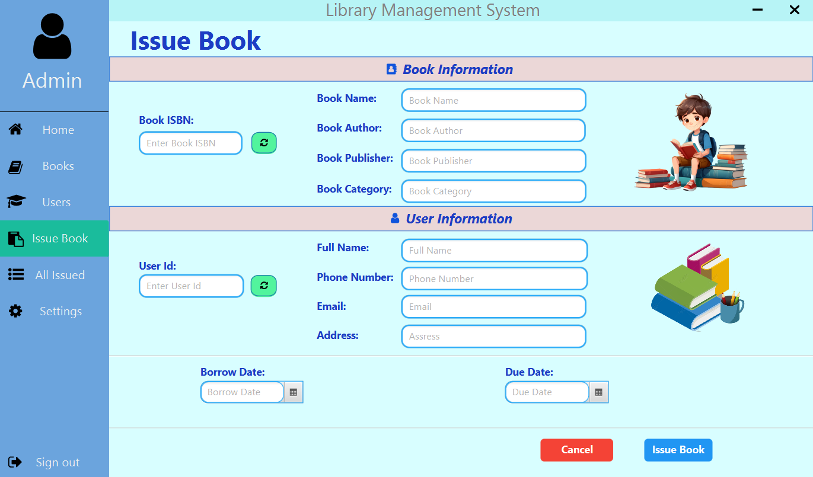
- Trang hiển thị chi tiết phiếu mượn sách đã được tạo, gồm các thông tin và mã QR chứa thông tin phiếu mượn, có thể chọn export để xuất phiếu mượn ra pdf và lưu vào máy.
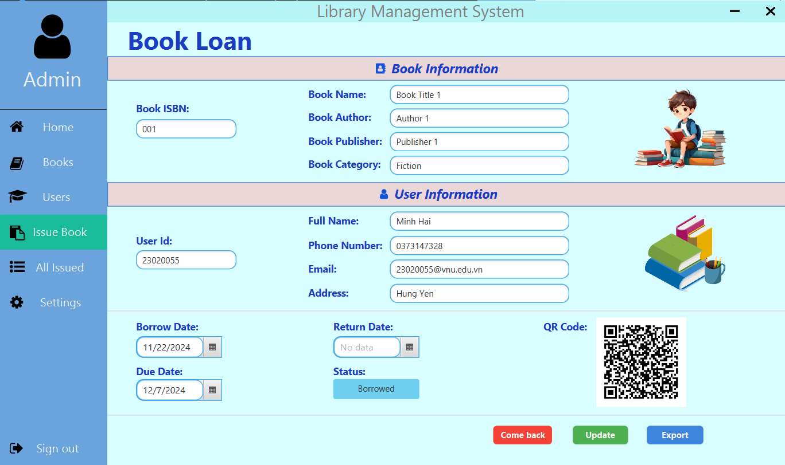
- Trang hiện thị tất cả các phiếu mượn, và các chức năng như thay đổi trạng thái, quét mã QR, xem chi tiết, sửa, xóa.
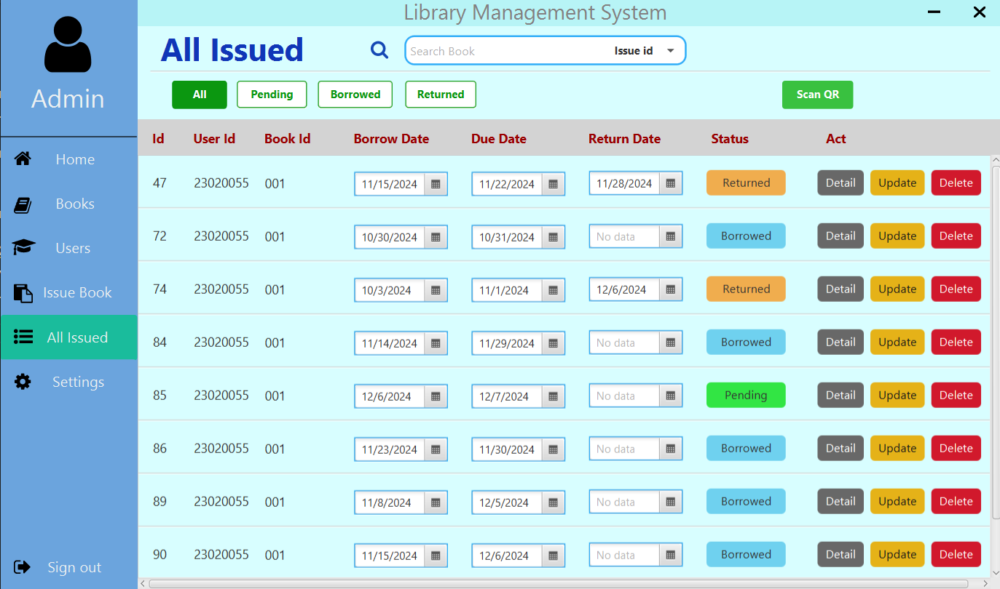
## Phía người dùng mượn sách.
- Trang dashboard chính cho người dùng , liệt kê các loại sách đang được ưu chuộng nhất tại thư viện theo từng thể loại.

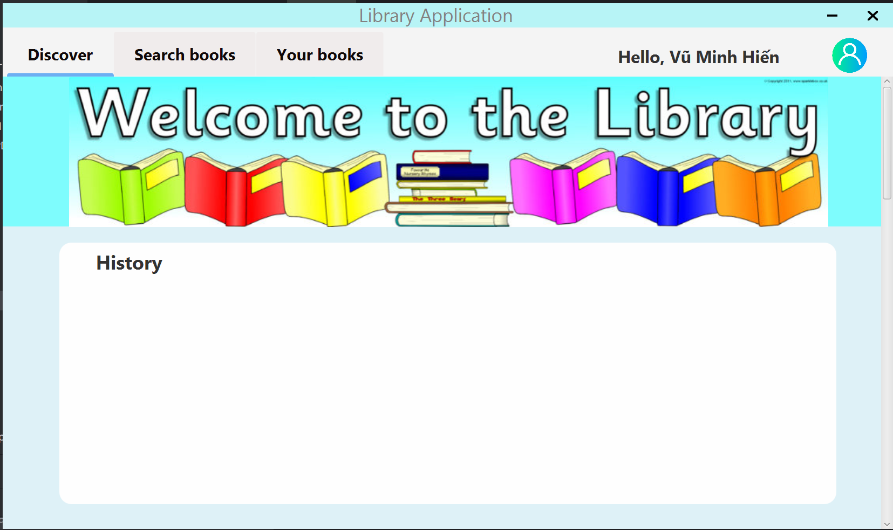
- Trang searching , nơi user có thể tìm kiếm sách mong muốn theo tên, thể loại, tác giả.

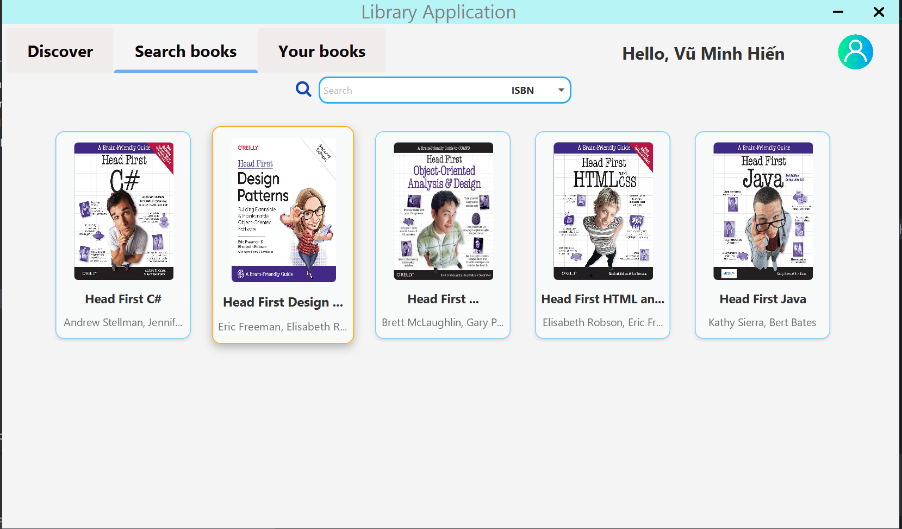
- Phần thông tin chi tiết cho sách, user có thể đọc các thông tin mô tả và có thể đọc review sách từ những user khác. Nếu muốn mượn sách online, user chỉ cần gửi request với ngày mượn và trả để ADMIN duyệt.

- User có thể comment nhận xét để chia sẻ cảm nghĩ với người khác.

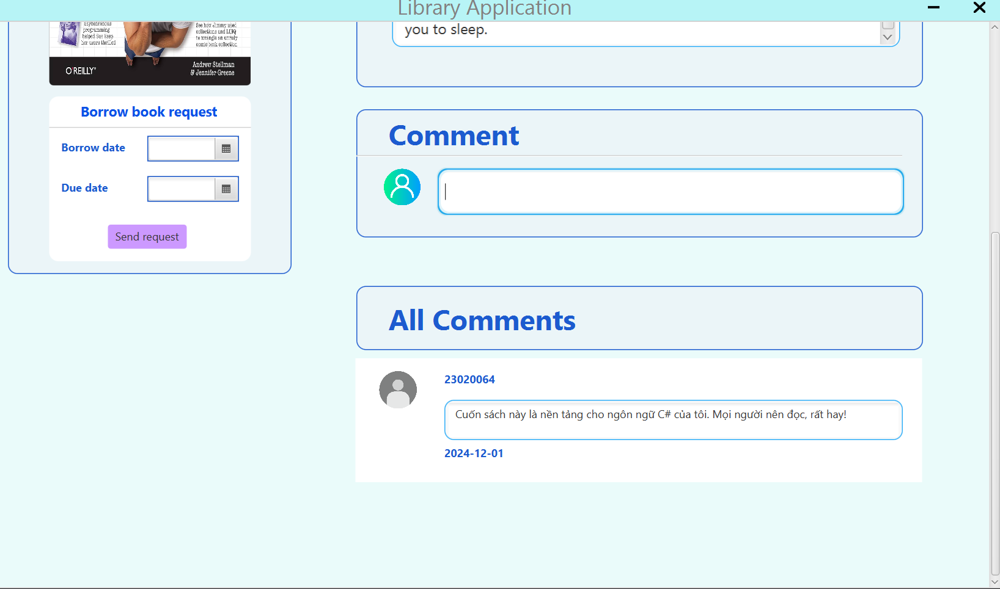
- Trang chứa thông tin về tình trạng sách của User: đang mượn, đã trả hoặc đang chờ ADMIN duyệt

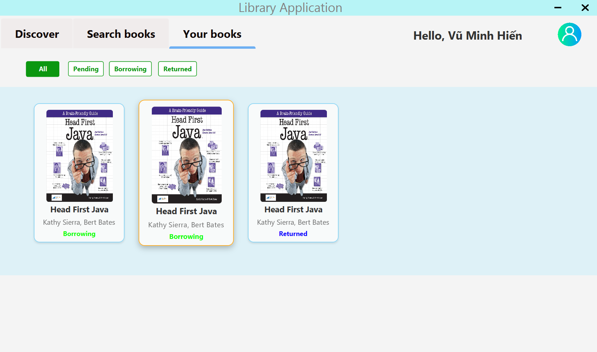
## Một vài tính năng chung khác của cả trang admin và user.
- Xem chi tiết thông tin tài khoản.
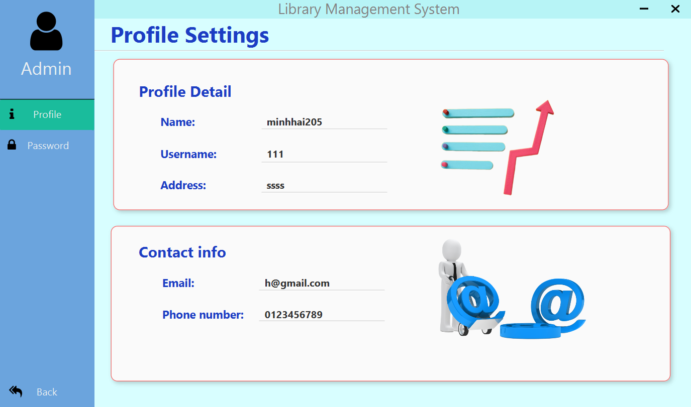
- Thay đổi mật khẩu.
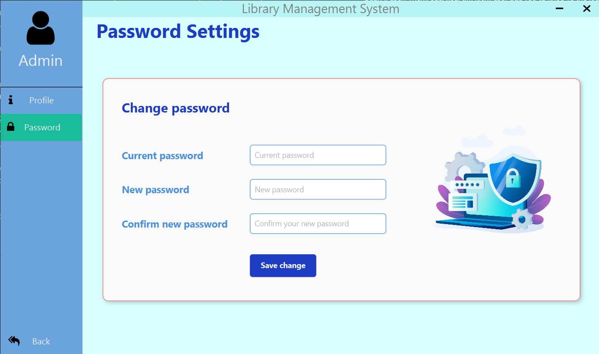
# Cây kế thừa của ứng dụng.

## Có dependencies:

# Lược đồ cơ sở dữ liệu của hệ thống.
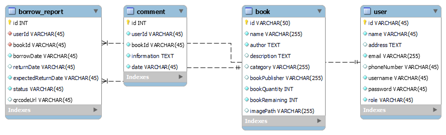
